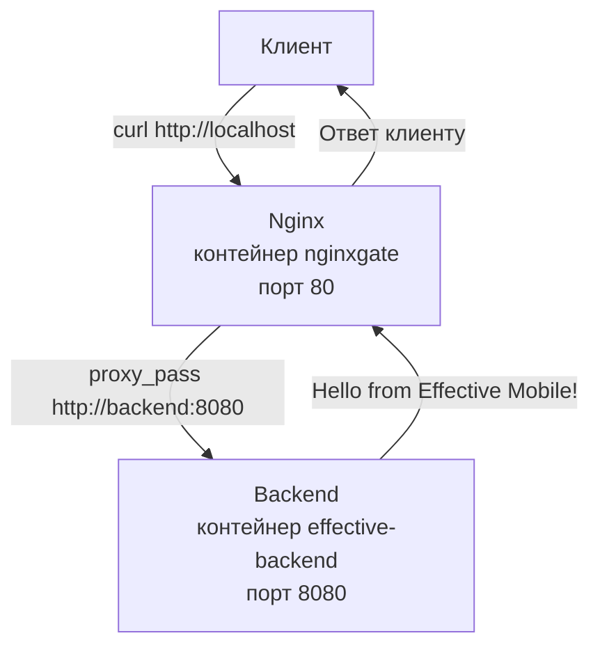

# git-basics
Repository for Git course.

## Mermaid Test

```mermaid
graph TD
    A[Клиент] -->|"curl http://localhost"| B[Nginx<br>контейнер nginxgate<br>порт 80]
    B -->|"proxy_pass http://backend:8080"| C[Backend<br>контейнер effective-backend<br>порт 8080]
    C -->|"Hello from Effective Mobile!"| B
    B -->|Ответ клиенту| A
```
